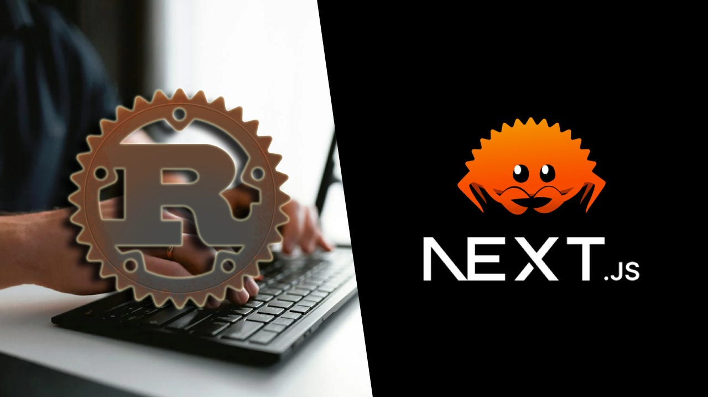

## Next.js + Rust template

Learn how use Rust in your existing JavaScript/Next.js projects and discover how to deploy Rust to production on Vercel.

You can use this template to get started writing Rust code in your Next.js project.

Read my blog post [Integrating Rust into Next.js: How-To Developer Guide](https://medium.com/@capJavert/integrating-rust-into-next-js-how-to-developer-guide-10e533470d71) for more info.

Running Rust in Next.js is powered by [Rust Runtime from Vercel Community](https://github.com/vercel-community/rust) ❤️
